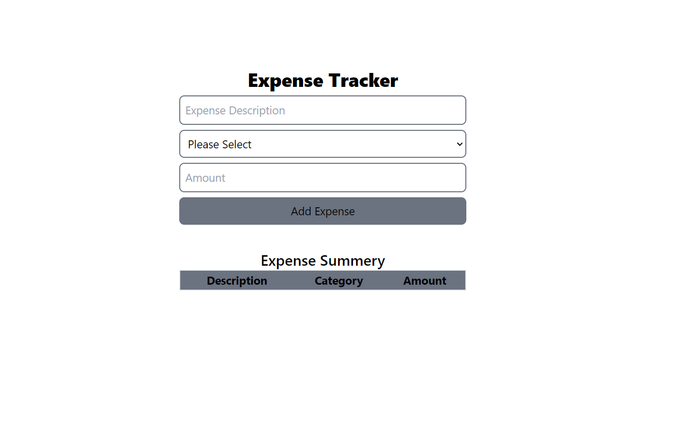
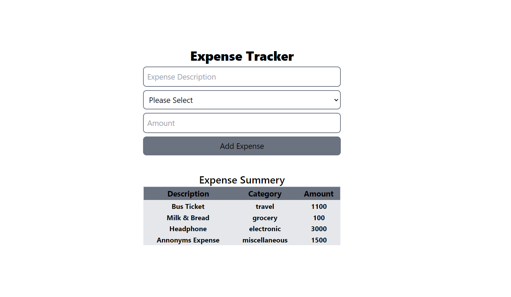

# Expense Tracker

This project is a web-based **Expense Tracker** application built using **HTML**, **JavaScript**, and **Tailwind CSS**. It allows users to log, track, and manage their daily expenses in a simple and intuitive interface.

## 🌟 Features

- **Add Expenses:** Enter and record daily expenses with details like amount, category, and description.
- **Expense Summary:** Displays a summary of total expenses for a selected date range.
- **Expense Categories:** Organize expenses by category (e.g., food, transport, entertainment, etc.).
- **Responsive UI:** Built with Tailwind CSS for a clean and mobile-friendly design.

## 📸 Screenshots

  
*Example 1*

  
*Example 2*

## 🛠️ Technologies Used

- **HTML:** For structuring the webpage.
- **JavaScript:** For handling user input, data storage, and calculations.
- **Tailwind CSS:** For styling and responsive design.

## 🚀 How to Use

1. Clone this repository to your local machine:

   ```bash
   git clone https://github.com/akashchaurasia3870/Expense-Tracker.git
   ```

2. Open the `index.html` file in your browser to start tracking your expenses.

---

Feel free to modify this as per your project specifics!